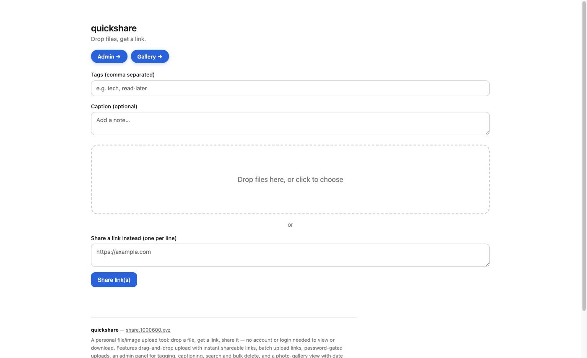
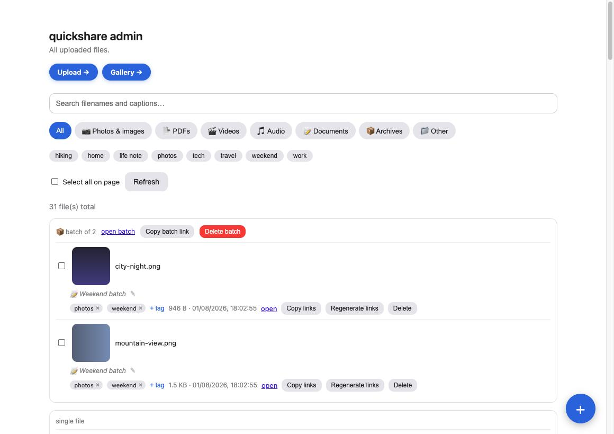
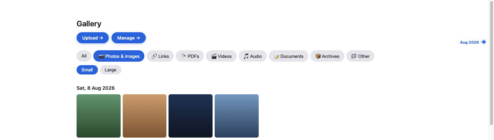

# quickshare

A personal file/image upload tool. Drop a file, get a link, share it. Built with [Claude Code](https://claude.ai/code).

**Live:** https://share.1000600.xyz

[English](#english) | [中文](#中文)

---

## English

quickshare exists for one reason: sometimes you just need to upload a screenshot, PDF, or video and hand someone a link — no account, no folder structure, no fuss. It's a single Cloudflare Worker backed by R2 storage, with no database and no build step.

### Screenshots

| Upload | Admin | Gallery |
|---|---|---|
|  |  |  |

*(Sample data shown above — not real uploads.)*

### Features

- **Drag-and-drop upload** — one file or many at once, from the browser
- **Share a link instead of a file** — paste one or more URLs and get a short quickshare link for each; opening it 302-redirects straight to the target, no upload needed
- **Instant shareable links** — each file gets a short, unguessable public URL (`/f/<id>/filename`) that needs no login to open
- **Batch links** — drop several files (or links) together and also get one link to a page listing just that batch, isolated from anything uploaded before or after
- **Password-gated uploads, public downloads** — uploading requires a password (saved once in the browser); viewing/downloading a shared link never does
- **Admin panel** (`/admin`) — see every upload grouped by batch, with size and upload date
  - Checkbox multi-select with bulk delete
  - Per-file delete and **regenerate link** (rotates a file to a fresh random link)
  - Regenerated links keep the old link alive for a **7-day grace period** before it expires, so a share you already sent doesn't break instantly
  - A floating "+" button stays on screen while scrolling through a long file list
- **Responsive layout** — usable on a phone, and widens up to 1000px on desktop/laptop screens
- **No database** — everything lives in R2; the admin list is built by enumerating bucket objects

### Stack

Cloudflare Workers (JavaScript, single file) + Cloudflare R2, deployed with Wrangler. No frameworks, no build step.

### Changelog

**2026-08-04**
- Share a link (or a few) without uploading a file — a new "share a link instead" field on the upload page stores each URL as a redirect rather than file bytes, reusing the existing tags/captions/batch/admin/gallery machinery. Multiple links shared together land on the existing batch page as a simple link list. New "🔗 Links" type filter on admin and gallery.

**2026-08-01**
- Multi-line captions on both the upload page and the admin inline editor
- Type filter chips (Photos & images / PDFs / Videos / Audio / Documents / Archives / Other) on the admin page, matching the gallery
- Restyled the Upload/Admin/Gallery cross-links as colored pill buttons, and gave every page a link to both of the others
- Custom confirm modal (Cancel/Delete) for every delete action — single file, batch, and bulk-selected; single-file delete previously had no confirmation at all
- Site footer with the live URL and a short feature summary on all three pages
- Fixed a bug where editing a caption or tag reset a file's displayed date to "now" — the true upload date is now preserved in R2 customMetadata across edits and link regeneration
- Small/Large thumbnail size toggle on the gallery (pure CSS, no new thumbnail assets)
- Tag autocomplete on the upload page's tag field and the admin page's per-file tag-add input, suggesting existing tags as you type
  - Fixed a race where a delayed blur-close could wipe a freshly-reopened suggestion dropdown
  - Fixed the suggestion dropdown rendering behind the next file card (stacking-context issue); also added `Cache-Control: no-store` to the app pages after discovering a stale browser cache was masking the fix during testing

---

## 中文

quickshare 是一个个人文件/图片上传工具。目的很简单：有时候你只是想上传一张截图、一份 PDF 或一段视频，然后把链接发给别人——不需要账号，不需要整理文件夹，越简单越好。它是一个单文件的 Cloudflare Worker，后端存储用 R2，没有数据库，也不需要构建步骤。

### 截图

| 上传页 | 管理面板 | 相册 |
|---|---|---|
|  |  |  |

*（以上为示例数据，非真实上传内容。）*

### 功能特性

- **拖拽上传** — 支持单个或同时上传多个文件
- **只分享链接，不用上传文件** — 粘贴一个或多个网址即可生成对应的简短 quickshare 链接，打开后会直接 302 跳转到目标网址
- **即时生成分享链接** — 每个文件都会生成一个简短、不可猜测的公开链接（`/f/<id>/文件名`），打开时无需登录
- **批量链接** — 一次拖入多个文件（或链接）时，除了各自的链接外，还会生成一个"合集"链接，展示这一批内容，与之前或之后上传的文件互不影响
- **上传需要密码，下载无需密码** — 上传文件需要输入密码（浏览器会记住），但打开分享链接查看/下载文件完全不需要密码
- **管理面板**（`/admin`）— 按批次查看所有已上传文件，显示大小和上传时间
  - 勾选多个文件批量删除
  - 单个文件删除，以及**重新生成链接**（把文件换到一个全新的随机链接上）
  - 重新生成链接后，旧链接会保留 **7 天的过渡期** 才失效，避免已经发出去的链接立刻失效
  - 悬浮的"+"按钮始终固定在屏幕上，方便在长长的文件列表中随时跳转到上传页面
- **响应式布局** — 手机上正常显示，桌面/笔记本电脑屏幕下最宽可达 1000px
- **无需数据库** — 所有数据都存在 R2 里，管理面板的列表是实时枚举存储桶中的对象生成的

### 技术栈

Cloudflare Workers（JavaScript，单文件）+ Cloudflare R2，用 Wrangler 部署。没有前端框架，不需要构建步骤。

### 更新日志

**2026-08-04**
- 新增"只分享链接、不上传文件"的功能——上传页新增"改为分享链接"输入框，每个网址会作为跳转链接存储（而非文件内容），复用现有的标签/备注/批量/管理面板/相册等全部机制。一次分享多个链接时，会像批量文件一样生成一个列出所有链接的合集页面。管理面板和相册新增"🔗 链接"类型筛选。

**2026-08-01**
- 上传页和管理面板的行内编辑器，标题/备注（caption）字段支持多行输入
- 管理面板新增类型筛选标签（图片 / PDF / 视频 / 音频 / 文档 / 压缩包 / 其他），与相册页保持一致
- 将上传、管理、相册三个页面之间的跳转链接改为彩色胶囊按钮样式，并让每个页面都能直接跳转到另外两个页面
- 所有删除操作（单个文件、整批、批量勾选）新增自定义确认弹窗（取消/删除）；此前单文件删除完全没有二次确认
- 三个页面底部新增页脚，展示网站链接和功能简介
- 修复了编辑标题或标签会把文件显示的日期重置为"当前时间"的问题——真实上传时间现在会保存在 R2 的 customMetadata 中，编辑或重新生成链接都不会覆盖它
- 相册页新增缩略图"小/大"尺寸切换（纯 CSS 实现，不生成新的缩略图文件）
- 上传页的标签输入框和管理面板每个文件的"+标签"输入框新增自动补全，输入时会提示已有的相似标签
  - 修复了一处竞态问题：失焦后延迟关闭的建议下拉框，可能会在重新聚焦后误把刚打开的下拉框关掉
  - 修复了建议下拉框被下一个文件卡片遮挡的层级问题；排查过程中发现浏览器缓存了旧版本页面导致看不到修复效果，因此也给这几个页面加上了 `Cache-Control: no-store`
